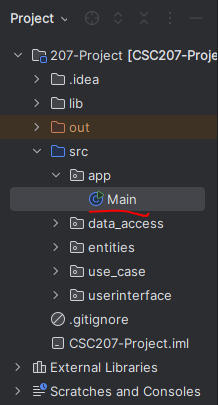

### How to Run the Program
- To run the game in the console, open the `Main.java` file and click the run button at the top right of the IDE.
  
- After running the game, you should see a prompt in the console to start. Instructions to simulate a game between Alice and Bob will follow.
  
  

### How the Game Works
- This is a two-player trivia game where you select your game settings, and the API will generate random trivia questions. Each player alternates turns answering questions. For each correct answer, a player earns a point. The player with the most points at the end wins the game.

### What Has Been Done
- Currently, some UI components, such as the main menu and quiz gameplay screen, are completed. The game also works in the console. Additionally, we’ve implemented data persistence, saving each game's score to a text file called `result.txt`.
  
  

### What Needs to Be Finished
- Next, we need to integrate our UI with the main game to display questions and capture user input. We also need to implement settings selection in the main menu. Additionally, we may look into creating a single-player mode and potentially adding support for more than two players if time permits.
