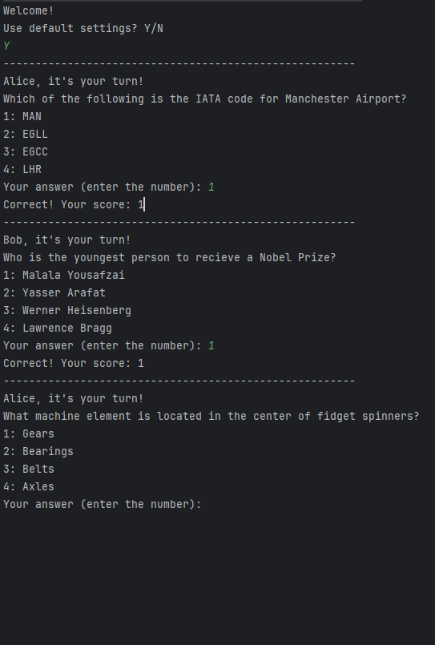
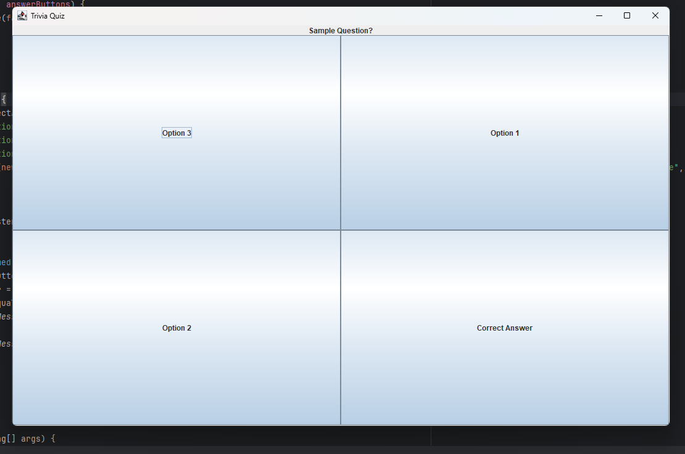
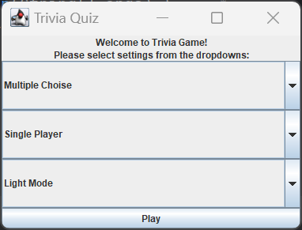

### How to Run the Program
- To run the game in the console, open the `Main.java` file and click the run button at the top right of the IDE. WARNING! The background music that will play immediately may be a bit loud. Please make sure your volume is not high!
  
- After running the game, a screen should pop up looking like this:
  
  

### How the Game Works
- This is a two-player trivia game where you select your game settings, and the API will generate random trivia questions. Each player alternates turns answering questions. For each correct answer, a player earns a point. The player with the most points at the end wins the game.

### What Has Been Done
- Currently, some UI components, such as the main menu and quiz gameplay screen, are completed. The game also works in the console. Additionally, we’ve implemented data persistence, saving each game's score to a text file called `result.txt`.
  
  

### Features of the Program
- Adherence to SOLID principles: Single Responsibility Principle, Liskov Principle, and Dependency Inversion Principle
- Adherence to Clean Architecture (no violation of the dependency rule)
- Utilizes Design Patterns: Dependency Injection Pattern, Observer Pattern, Strategy Pattern, and Adapter Pattern
- Advanced UI: follows principles of universal design such as Tolerance of Error and Simple and Intuitive UI
- Accessibility feature: Dark Mode
- Background Music
